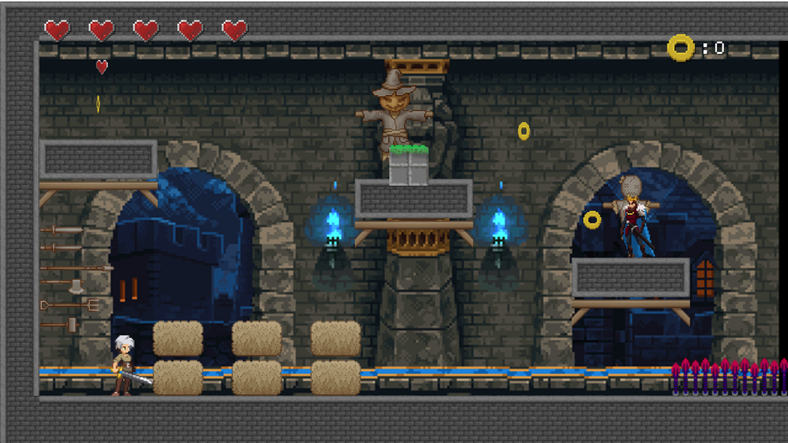
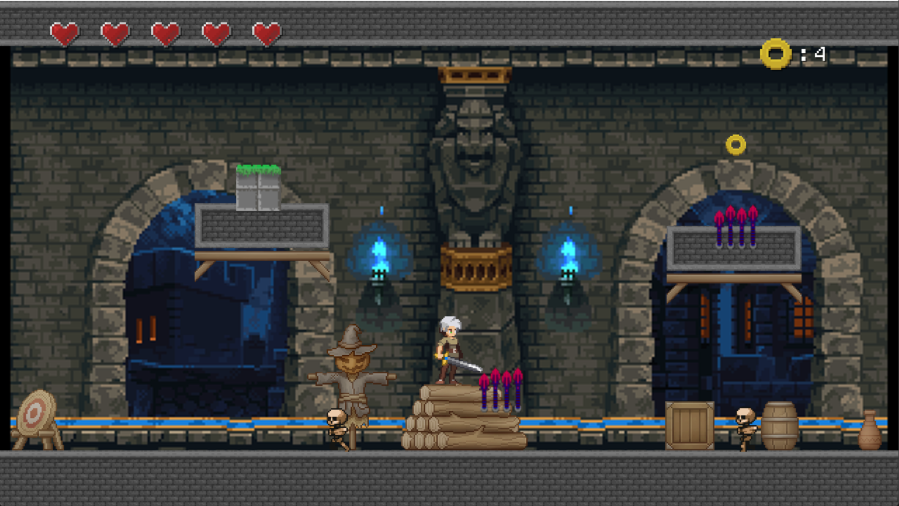
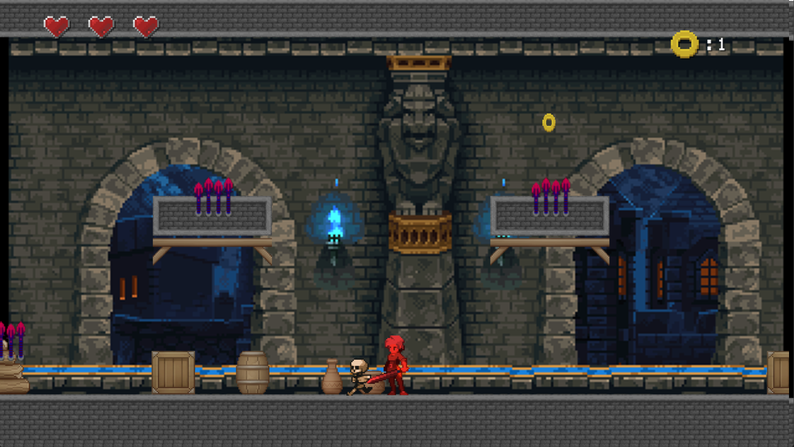
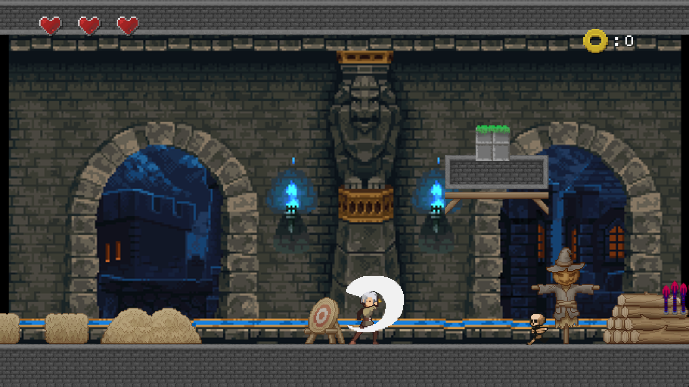

# PLATFORMER GAME DEVELOPED IN LUA USING LOVE2D
Here is a small project of a 2D platform game developed in lua, using love2D. It's a simple game concept made for learning and fun, feel free to play and modify the game to your liking.

The game can be played using the W,A,S,D and E keys to move and attack respectively.

The objective of the game is simple, collect as many lives as possible throughout the stages to defeat the final boss and reach the princess.

The small enemies along the way do not suffer damage, only the final boss.

Be careful with the thorns, they can cause damage!

Enjoy!

## HOW RUN?
1º - download love2d, latest version.
2º - download the project zip paste.
3º - move the folder to another destiny (desktop).
4° - open teh folder with vscode.
5º - install love2d extension.
6º - go to main file and press alt + L.
7º - good play!

## SCREENSHOTS

